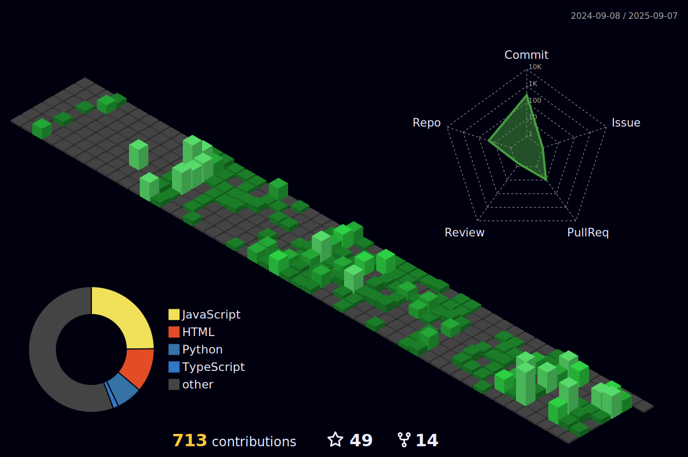

<!-- Typing SVG by DenverCoder1 - https://github.com/DenverCoder1/readme-typing-svg -->

 

.gif)

<h1 align="center">Hi There! &nbsp;&nbsp;&nbsp;We are </h1>

<!-- <h1 align="center">Greetings! &nbsp;&nbsp;&nbsp;We Are GOMUGOMU STUDIOS</h1> -->

<h3 align="center">

</h3>

<h3 align="center"><strong>✨ <em>"Turning Ideas into Worlds — Animation, Design & Software That Inspire."</em> ✨</strong></h3>

  

  

## 🌟 About GOMUGOMU STUDIOS

We are a **hybrid technology and creative studio** that bridges the gap between cutting-edge software development and stunning visual design. Our multidisciplinary team excels in both **technical innovation** and **creative excellence**.

- 💻 **Current Tech Projects:** Enterprise web applications, custom software solutions, API development
- 🎨 **Current Creative Work:** 3D animations, product visualizations, brand identity design
- 🌱 **Always Learning:** Latest frameworks, animation tools, AI/ML, creative technologies
- 💬 **Talk to Us About:** Full-stack development, 3D modeling, web design, animation, software architecture
- 📫 **Reach Our Teams:** contact.gomugomu@gmail.com | info.gomugomu@gmail.com 
- 🤝 **Open for Collaboration:** Tech startups, creative agencies, product launches, digital transformations
- 👀 **We're Passionate About:** Solving complex problems with elegant code AND beautiful design

  
  
  

## 🚀 Our Dual Expertise

<table align="center" style="border: none;">
<tr>
<td width="50%" align="center" style="border: none;">

### 💻 **TECHNOLOGY SOLUTIONS** 🔥
- **Custom Web Applications**
- **Full-Stack Development** 
- **E-Commerce Platforms**
- **API Development & Integration**
- **Database Design & Architecture**
- **Cloud Solutions & DevOps**
- **Mobile Applications**
- **Enterprise Software**

</td>
<td width="50%" align="center" style="border: none;">

### 🎨 **CREATIVE SERVICES** 🔥
- **3D Modeling & Animation**
- **Motion Graphics & VFX**
- **Product Visualization**
- **Brand Identity Design**
- **UI/UX Design**
- **Packaging Design**
- **Character Animation**
- **Interactive Experiences**

</td>
</tr>
</table>

## 🏆 Why Choose GOMUGOMU STUDIOS?

💻 **Technical Mastery** → Enterprise-grade software solutions with modern architecture  
🎨 **Creative Excellence** → Award-winning designs and animations that captivate audiences  
🔄 **Full-Service Approach** → Complete digital solutions from code to visual storytelling  
🏛️ **Proven Track Record** → Government contracts and Fortune 500 client deliveries  
⚡ **Rapid Innovation** → Agile development + creative iteration for faster results  
🌐 **Industry Versatility** → Deep experience across tech, entertainment, and business sectors

<h2 align='center'><strong>Connect With Our Teams 🌐</strong></h2>

  

  

<h2 align='center'><strong>Our Complete Technology & Creative Arsenal 🛠️</strong></h2>
 
<table>
	<tr>
		<td><strong>Frontend Development</strong></td>
		<td></td>
	</tr>
	<tr>
		<td><strong>Backend & APIs</strong></td>
		<td></td>
	</tr>
	<tr>
		<td><strong>Programming Languages</strong></td>
		<td></td>
	</tr>
	<tr>
		<td><strong>3D & Animation Software</strong></td>
		<td>  </td>
	</tr>
	<tr>
		<td><strong>Design & Graphics</strong></td>
		<td>  </td>
	</tr>
	<tr>
		<td><strong>Motion Graphics & VFX</strong></td>
		<td>  </td>
	</tr>
	<tr>
		<td><strong>Database Technologies</strong></td>
		<td></td>
	</tr>
	<tr>
		<td><strong>Cloud & DevOps</strong></td>
		<td></td>
	</tr>
	<tr>
		<td><strong>Mobile Development</strong></td>
		<td></td>
	</tr>
	<tr>
		<td><strong>Collaboration Tools</strong></td>
		<td>  </td>
	</tr>
</table>

  

<h3 align='center'><strong>Github Analytics ⚙️</strong></h3>

 

<markdown-accessiblity-table data-catalyst="">
  <table style="width: 100%; background-color: #1e1e1e; color: white; table-layout: fixed;">
    <thead>
	    <tr>
		  <th colspan="2" align="center">
			   
		  </th>
		</tr>
      <tr>
        <th style="padding: 20px; text-align: center;">
          
        </th>
        <th style="padding: 20px; text-align: center;">
          
        </th>
      </tr>
    </thead>
	   <tr>
        <td  colspan="2" align="center"> 
		 
	
		
<picture>
  		<source media="(prefers-color-scheme: dark)" srcset="https://raw.githubusercontent.com/The-Abhishek-Singh/The-Abhishek-Singh/output/github-contribution-grid-snake-dark.svg" />
  <source media="(prefers-color-scheme: light)" srcset="https://raw.githubusercontent.com/The-Abhishek-Singh/The-Abhishek-Singh/output/github-contribution-grid-snake.svg" />
  
</picture>
	</td>
	</tr>
  </table>
  
</markdown-accessiblity-table>

